# 《StickyNotes 技术债清偿与架构重构 Roadmap》

> 依据：《StickyNotes 架构与代码质量深度审计报告》（2026-08-14，全量静态审计 + 动态验证：Core 605 测试全绿、App 553 测试暴露 2 个运行期缺陷）。
> 门控：Constitution Principle XII（TDD：每个修复任务必须先有能**确定性失败**的 Red Test；写不出 Red Test 的任务降级为 CI 静态门控或重新评估）。
> 约束：本文档只含架构规划、任务拆解、依赖关系与测试策略——**不含任何实现代码**。

---

## 1. 依赖与风险拓扑图 (Dependency & Risk Graph)

```mermaid
flowchart TD
    subgraph P1["Phase 1 · Sprint 1 — 紧急止血与数据安全"]
        direction TB
        R1_1[R1.1 保存链路竞态<br/>App + EditorCore]
        R1_2[R1.2 DiagnoseLog 移除/门控<br/>App]
        R1_3[R1.3 捕获失败吞错修复<br/>App + AssetStore]
        R1_4[R1.4 缩略图真实渲染<br/>App + AssetStore]
        R1_5[R1.5 HTTPS-only 强制<br/>SyncCore]
        R1_6[R1.6 Banner 状态接线<br/>App]
        R1_7[R1.7 便签导入 + sidecar<br/>App + Domain]
    end

    subgraph P2["Phase 2 · Sprint 2 — 核心链路修复"]
        direction TB
        R2_1[R2.1 冲突副本面接线<br/>App]
        R2_2[R2.2 跨块复制接线<br/>App + EditorCore]
        R2_3[R2.3 FileAvailability 真实接线<br/>App + SystemBridge]
        R2_4[R2.4 ScreenshotViewer open 契约<br/>App]
        R2_5[R2.5 同步状态展示单一化<br/>App + SyncCore]
        R2_6[R2.6 搜索回退策略收紧<br/>App]
    end

    subgraph P3["Phase 3 · Sprint 3+ — 架构净化与现代化"]
        direction TB
        R3_1[R3.1 AppEnvironment 瘦身]
        R3_2[R3.2 死代码批次清理]
        R3_3[R3.3 canonicalJSON 收敛]
        R3_4[R3.4 Domain 边界修正]
        R3_5[R3.5 TodoHierarchy 迁入 Domain]
        R3_6[R3.6 规则单源化]
        R3_7[R3.7 CardProjection 有界化]
        R3_8[R3.8 API 现代化批次]
        R3_9[R3.9 macOS 27 Research Spike]
        R3_10[R3.10 测试真实化批次]
    end

    R1_1 --> R2_2
    R1_3 --> R1_4
    R1_5 --> R2_5
    R1_6 --> R2_5
    R1_7 --> R2_1
    R2_3 --> R3_6
    R2_5 --> R3_6
    R3_3 -. SyncCore 依赖 .-> R3_4
    R3_4 -. Domain 边界修订 .-> R3_5
    R3_9 -. Spike 结论决定 .-> R3_8
    R3_10 --> R1_2
```

**依赖拓扑要点**（违反即引入回归）：

| 边 | 语义 | 违例后果 |
|---|---|---|
| R1.3 → R1.4 | 捕获失败必须先正确传播，缩略图渲染才有真实输入 | 先做 R1.4 会把"空数据截图"当正常输入渲染 |
| R1.1 → R2.2 | 保存竞态不修，跨块复制/删除接线后删除仍可能复活 | 数据一致性雷先于功能接线 |
| R1.5 → R2.5 | HTTPS 强制先落地，状态展示才反映真实错误类别 | 状态机展示"虚假健康" |
| R1.7 → R2.1 | 导入/导出真实化后，冲突副本才有真实数据来源可接线 | 冲突副本接在未验证的持久化链路上 |
| R3.3/R3.4 → R3.5 | canonicalJSON 收敛与 Domain 边界修订先行，TodoHierarchy 迁移不触碰编码层 | 迁移期间跨模块编码不一致 |
| R3.9 → R3.8 | Spike 结论（AttributedTextSelection 等）决定 API 现代化采用/搁置 | 未经评估直接迁移选区桥有返工风险 |

**各 Phase 最高风险点与缓解预案：**

| Phase | 最高风险 | 缓解预案 (Mitigation Plan) |
|---|---|---|
| P1 | **R1.1 竞态修复引入新时序问题**（保存串联后 flush 语义变化 → 窗口关闭丢最后编辑） | 修复后全量并行跑 3 轮 + 串行跑 1 轮对比；关闭路径的 flush 测试（`flush()` 必须 await 串联链尾部）纳入 DoD；`AutoSaveRevisionToken` 在 DB 层生效后加 token 不匹配即丢弃的契约测试 |
| P1 | **R1.3 失败传播后 UI 无错误面**（FR-011a 非阻塞表面） | 捕获失败复用现有 `statusMessage` 通道 + 新增 toast 文案；不做模态弹窗（FR-026 约束） |
| P1 | **R1.5 已配置 http:// 端点的存量用户被强制拦截** | 设置界面同步显示 https 校验提示（同 Sprint 的 UI 联动子任务）；仅拒绝新配置，存量配置在下次同步前给出一次性升级提示 |
| P2 | **R2.1 冲突副本接线后与既有卡片渲染路径重复**（`NoteCardRow.isConflictCopy` 已内联渲染） | 先删后接：移除内联 badge 渲染，统一走 ConflictCopyView 组件；以视觉一致性测试（卡片网格对比）防双实现 |
| P3 | **R3.9 Spike 结论为"不迁移"时 R3.8 范围收缩** | Spike 先行并产出决策记录（ADR）；R3.8 的 RTF/DateFormatter/Task.sleep 项不依赖 Spike，可并行推进 |

---

## 2. Phase 1: 紧急止血与数据安全 (Sprint 1)

*目标：消灭数据一致性雷（已删块复活）、发布版调试泄漏、捕获链路假象；同步传输安全底线。*

| 任务 ID | 任务名称 (Epic/Story) | 归属模块 | 前置依赖 | 🧪 Red Test 设计 (如何构造失败用例) | 验收标准 (DoD) |
|---|---|---|---|---|---|
| R1.1 | **保存链路竞态修复**：`updateBlocks` 的 `pendingEditTask` 覆盖不串联 + `persistBlocks` 非原子 diff 导致旧快照复活已删块（`EditorPersistenceTests.emptyBlockRemovalPersists` 间歇失败实证） | App（`NoteWindowHostModel`）+ EditorCore（`AutoSaveDraftManager`） | 无 | **确定性化现有间歇测试**：注入可控延迟的 repository 包装——第一个结构性保存的 `fetchBlocks` 完成后、`insert` 前插入 barrier，第二个结构性保存（删块后的快照）先完成；断言 `flush()` 后 `fetchBlocks` 的 id 集 **不含** 已删块。现有测试在并行全量下已可复现（2 轮全量 1 轮失败），修复前用"延迟注入"让它 100% 失败 | ① 注入版 Red Test 修复前必失败、修复后必绿；② 全量并行 3 轮 + 串行 1 轮零失败；③ `AutoSaveRevisionToken` 不再被 sink 丢弃（token 校验契约测试）；④ 窗口关闭 flush 不丢最后编辑（既有关闭路径测试保持绿） |
| R1.2 | **DiagnoseLog 移除/门控**：发布版 `NSTemporaryDirectory()` 明文日志，8 个调用点覆盖每次拖动/聚焦（FR-165/191 违规） | App（`RichTextView`、`RichTextBlockView`、`EditorSelectionBridge`、`NoteWindowHostModel`） | R1.1（日志与保存路径同文件，先修竞态再动文件） | **行为型 Red Test**：扩展 `DiagnosticsPrivacyTests` 模式——模拟编辑器交互（焦点/拖动事件序列），断言所有经 `StickyLogger` 出口的日志**不含**几何数值与响应者状态明细（FR-191 消毒断言）。该测试在 DiagnoseLog 存在时（直写文件绕过 Logger）**无法通过**，强制先收敛日志出口 | ① 诊断消毒测试绿；② `App/Sources` 内 `NSTemporaryDirectory()` 零匹配（CI 门控）；③ 原调试信息经 `StickyLogger.debug` 消毒参数或直接删除；④ Release 构建产物无该符号 |
| R1.3 | **捕获失败吞错修复**：`CaptureFlow` catch 把错误转成空 `Data`，空 PNG 被当成功截图入库并插块（击穿 Core T303 fail-closed） | App（`CaptureFlow`/`WindowPickerObserver`、`NoteWindowHostModel.captureScreenshot`）+ AssetStore（验收配合） | 无 | ① 注入抛错 provider（`captureSingleFrame` 恒 throw），断言 `captureScreenshot` 返回 `false`、块列表不变、AssetStore 记录数不变；② 注入空 `Data` provider，断言**拒绝导入**（不产生资产、不插块）；③ 注入"原图成功、缩略图失败"provider，断言 `thumbnailAssetId` 不得回退为 `originalAssetId`（SC-008），块 payload 中缩略图字段为 nil | ① 三个 Red Test 修复前必失败；② 失败路径经 FR-011a 非阻塞状态面呈现；③ 缩略图缺失时 UI 显示降级态而非原图 |
| R1.4 | **截图/图片块真实缩略图渲染**：内联块只渲染 SF Symbol 占位，从不加载 payload 中的 `thumbnailAssetId`（FR-094a 声明与实现不符） | App（`ScreenshotBlockView`、`RichTextBlockView`）+ AssetStore（`readData` 复用） | R1.3（先保证输入数据真实） | 将"块 payload → 渲染源"提炼为可测的 presentation 状态机（纯类型，含 thumbnail 加载态/占位态/失败态）；Red Test：构造含合法 `thumbnailAssetId` 的 screenshot 块 + 注入返回真实 PNG 的 provider，断言状态为"加载真实缩略图"而非"占位"；构造 provider 返回 nil，断言进入降级占位态（不崩溃） | ① 状态机测试绿；② 视图消费该状态机（视图层不做载荷解析）；③ 卡片网格仍不解码原图（既有 SC-008 测试保持绿） |
| R1.5 | **HTTPS-only 强制**：宪法 VIII 声明 HTTPS-only，但两个 provider 无 scheme 校验，`pinnedFingerprint` 死字段、`TrustConfiguration` 不存在 | SyncCore（`WebDAVProvider`、`S3Provider`） | 无 | ① 构造 `http://` 端点配置，断言 provider 初始化（或首次 `verify()`）抛出 `invalidEndpoint`/TLS 类错误；② 构造 `https://` 配置，断言正常通过（不误伤）；③ 声明了 `pinnedFingerprint` 的配置在未实现 pinning 时构造即失败（删除死字段或实现 TrustConfiguration，二选一进 DoD） | ① Red Tests 绿；② 设置界面同步展示 https 校验提示（App 联动子任务）；③ 死字段清理（删除或落地 pinning，决策记录进 DoD） |
| R1.6 | **Banner/状态展示接线**：`vaultLocked` 在两处生产调用点硬编码 `false`（needsUnlock 类别不可达），banner 4/5 按钮空操作 | App（`LibraryModel.refreshBanner`、`SyncSettingsView.resolvedPresentation`、`performBannerAction`） | 无 | ① 构造 `syncCoordinator.isVaultUnlocked == false` 的桩状态，断言 `refreshBanner` 产出 `.needsUnlock` 类别（修复前恒为 nil）；② 逐类别断言：`authFailed`/`conflictCopiesCreated`/`historyAgedOut`/`pendingChanges` 各自可达；③ 对 `.unlock`/`.reauthenticate`/`.viewConflicts`/`.advancedRecovery` 类别调用 `performBannerAction`，断言对应 coordinator 方法被调用（修复前静默无操作） | ① 三组 Red Tests 绿；② 状态映射单一来源（`SyncStatusResolver`），删除硬编码 `false`；③ banner 按钮全部真实可达 |
| R1.7 | **便签 JSON 导入 + 资产 sidecar 真实化**：导入无 UI/流程，导出丢弃 `assetBytes` 不写 sidecar（导出即丢图） | App（`NoteExportImport`）+ Domain（`NoteDocumentSerializer` 能力已有） | 无 | ① **导入**：构造合法 note-document JSON（含 image 块）+ assets sidecar，走导入流程，断言 note+blocks 落库、资产字节入 AssetStore（当前无入口，测试编译即失败）；② **导出**：带 `assetBytes` 导出，断言 sidecar 文件与文档并列写出（当前不写，断言失败）；③ 损坏 JSON/缺 required key 断言 fail-closed 不产生半成品 note | ① Red Tests 绿；② 删除悬空导入注释；③ sidecar 读写路径在 App 层闭环（`encodeAssetSidecar`/`decodeAssetSidecar` 不再仅测试引用） |

**Phase 1 验收门**：全量测试（Core 605 + App 553）绿；`emptyBlockRemovalPersists` 并行 3 轮零失败；`App/Sources` 无临时文件日志；捕获失败不产生任何资产/块。

---

## 3. Phase 2: 核心链路修复 (Sprint 2)

*目标：消灭"已接线但未生效"的功能假象；同步链路契约加固。*

| 任务 ID | 任务名称 (Epic/Story) | 归属模块 | 前置依赖 | 🧪 Red Test 设计 (如何构造失败用例) | 验收标准 (DoD) |
|---|---|---|---|---|---|
| R2.1 | **冲突副本面接线**：`ConflictCopyView.swift` 整文件死代码，T171/US10 表面从未进入 UI（卡片 badge + 打开冲突副本窗口） | App（Library 卡片、NoteWindow 打开路径） | R1.7（导入/导出真实化后冲突副本有真实数据源） | ① 构造 `lifecycleState == .conflictCopy` 的卡片数据，断言网格渲染 badge 视图（当前渲染路径走内联 Bool，组件未实例化）；② 对冲突副本卡片执行打开，断言打开的是带冲突标签的副本窗口而非原笔记；③ 删除内联 badge 渲染后同一断言仍绿（防双实现） | ① Red Tests 绿；② `ConflictCopyView` 组件被真实消费，整文件不再死；③ 原笔记与副本窗口身份区分测试（FR-175） |
| R2.2 | **跨块复制接线**：`copySpanningSelection` 无生产调用方，FR-054 跨块复制功能未生效（删除已接、复制未接） | App（`RichTextView.keyDown` 键路径、`EditorAppBridge`）+ EditorCore（`CrossBlockSelection` 已有） | R1.1（保存竞态先修） | ① 构造跨块选区 + 模拟 ⌘C（`keyDown` 事件或直接调用键路径处理器），断言 `NSPasteboard` 同时含 plain 与 `public.rtf`；② 断言 RTF 仅含受支持 marks（复用 FR-053 既有断言，改为走真实键路径）；③ 无选区时 ⌘C 不写剪贴板（空操作契约） | ① Red Tests 绿；② 复制-粘贴-保存往返测试（粘贴端富文本还原 marks）；③ 单块选区行为不回归（既有复制路径测试保持绿） |
| R2.3 | **FileAvailability 真实接线**：默认 `.onAnotherDevice` 掩盖缺失调用方；真实分类器（`FileAvailabilityClassifier`）已存在但卡片不接 | App（`CodeBlockView`、`RichTextBlockView` 的 `availabilityProvider` 参数）+ SystemBridge（`SecurityScopedBookmarks` 复用） | 无 | ① 构造三种 locator 状态（bookmark 可解析、文件缺失、无 bookmark），断言卡片指示分别呈现 `.available`/`.missing`/`.onAnotherDevice` 且**默认参数不再被触发**（用一个哨兵默认值——断言生产调用点显式传入 provider，修复前默认值路径被静默使用）；② relink 后状态刷新断言 | ① Red Tests 绿；② 生产调用点全部显式传 provider；③ 删除误导性默认值；④ FR-100 四态 + 非纯颜色区分测试保持绿 |
| R2.4 | **ScreenshotViewer open 契约**：`openScreenshot` 默认空闭包且无真实调用方（FR-095a 导航契约假象）；zoom 与头注释不符（100%↔50% vs fit-to-window） | App（`ScreenshotViewer`、`MediaPresenters`） | R1.4（缩略图渲染真实化后 viewer 有真实内容） | ① 断言 viewer 的"打开截图"动作触发时调用方闭包被真实执行（注入计数闭包，当前默认闭包为 no-op → 失败）；② 双指/双击缩放循环断言：初始 fit、一次缩放后 ≥100% 实际尺寸且可平移（当前实现无 fit 计算 → 失败）；③ 或按决策改为**移除契约声明**：删除 FR-095a open 契约与缩放注释，断言 API 面与实现一致 | ① Red Tests 绿（实现或收缩二选一，决策记录）；② 头注释与行为一致；③ `MediaPresenters` 不再强制要求必传却被忽略的闭包 |
| R2.5 | **同步状态展示单一化**：`SyncStatusAction` 枚举生产侧死、banner 动作文本另行推导；`error(fromCode:)` 硬编码反查表与 Core 映射无联动；profile 导出 suite-version 硬编码回退 `?? 1` | App（`SyncStatusPresentation`、`SyncSettingsView`）+ SyncCore（公开 code→enum 反查 API） | R1.5、R1.6 | ① 断言 banner 动作与 `SyncStatusAction` 共用同一模型（当前双模型 → 编译/结构断言失败）；② Core 新增 ProviderError 反查公开 API 后，断言 App 侧不再存在字符串字面量表（引用 Core API 的编译期测试）；③ 构造 vault 未解锁状态导出 profile，断言 suite-version 为 nil 或明确错误而非静默 `1` | ① Red Tests 绿；② 删除 `SyncStatusAction` 死代码或使其成为唯一动作模型；③ 反查表删除；④ 导出无静默错误值 |
| R2.6 | **搜索回退策略收紧**：预 bootstrap 内存过滤是 FTS 语义子集（FR-023 宣称全文匹配，回退只匹配 title/summary/preview） | App（`LibraryModel.reload`） | 无 | ① 断言 bootstrap 完成后搜索路径**必然**走 `SearchService`（注入哨兵：禁用 FTS 时 reload 抛错而非静默降级）；② 构造仅正文命中（非 title/summary）的查询，断言结果含该 note（当前回退路径漏 → 失败） | ① Red Tests 绿；② 内存回退仅在无 store 时保留且显式标注；③ 搜索覆盖测试（FR-023 五类字段）走真实 FTS 路径 |

**Phase 2 验收门**：无"整文件死代码"（`ConflictCopyView` 被消费或删除）；无"可见但无操作"控件；同步状态类别全部可达；搜索路径单一化。

---

## 4. Phase 3: 架构净化与现代化 (Sprint 3+)

*目标：死代码清零、规则单源化、模块边界修正、API 现代化（含 macOS 27 Spike 决策门）。*

| 任务 ID | 任务名称 (Epic/Story) | 归属模块 | 前置依赖 | 🧪 Red Test 设计 (如何构造失败用例) | 验收标准 (DoD) |
|---|---|---|---|---|---|
| R3.1 | **AppEnvironment 瘦身**：5 个空服务分组（`DomainServices`/`EditorServices`/`SecurityServices`/`SyncServices`/`SystemBridgeServices`）+ `tombstoneRepository`/`cardProjection` 死属性 + 未用的 `localPreferences` 槽位 | App（`AppEnvironment`） | R1.6（sync 状态经真实槽位流动） | 结构断言测试：枚举 `AppEnvironment` 成员，断言每个服务槽位在 App+AppTests 中至少一次解引用（当前 5 个槽位 0 次 → 失败）；空分组类型删除后编译期断言其不再存在 | ① 结构断言绿；② 空分组删除或填充真实服务（决策记录）；③ 环境初始化调用点同步收缩 |
| R3.2 | **死代码批次清理**：`AutoLinkDetector` 旧扫描器 5 函数、`SecurityCoreModule`/`SyncCoreModule` 空壳、`CrossBlockSelection:126` 字面死循环、`ManualSortKeys.normalize` 恒真 precondition、`ReadableTheme.background(for:)`/`NotePalette.color(for:)`/`AccessibilityAdaptations` 枚举、`DisplayFormatters.dateTime`、`LocalPreferences` 3 方法、未用 import ×5、`#available(macOS 26)` 不可达 else、`AppMetrics` 3 常量、`RegionSelectionOverlay.setupLayer` 未用参数 | EditorCore、Domain、SecurityCore、SyncCore、App（按符号归属） | R2.x 完成后（避免误删待接线符号） | **删除即验证**：每批删除后全量编译 + 测试绿即 Red（删除前符号存在本身是"失败状态"）；对疑似误删风险符号（如 `AccessibilityAdaptations` 先确认无运行时消费者）用 grep 门控测试断言零引用 | ① 全量编译 + 测试绿；② CI 死符号扫描（见 §5）零告警；③ 删除清单与审计报告 D-1…D-17 逐条对账 |
| R3.3 | **canonicalJSON 收敛**：4 处手写 `sortedKeys` 编码器（`EncryptedEnvelope`/`VaultBootstrap`/`SyncedAssetBlob`/`DiagnosticBundle.encode`）统一走 `Domain.CanonicalJSONEncoder`，日期策略收敛为同一格式 | SecurityCore、SyncCore（消费方）+ Domain（提供方） | 无 | ① 对每个类型：编码 → 用 `CanonicalJSONDecoder` 解码 → 等值断言（当前各类型自有编码器与 Domain 日期策略不同，含日期字段的 `VaultBootstrap` 往返字节与 canonical 编码不同 → 失败）；② 字节级 golden 测试：既有测试 fixture 字节不变（防回归） | ① Red Tests 绿；② 全库仅剩 `CanonicalJSONEncoder` 一处 `sortedKeys` 定义（grep 门控）；③ 既有加密向量测试（`EncryptionVectorTests`）保持绿 |
| R3.4 | **Domain 模块边界修正**：`import os`（`Logging.swift`）与 `import CryptoKit`（`RemoteManifest.swift` SHA256）突破 "Foundation-only" 声明 | Domain + SecurityCore | R3.3（SHA256 收敛顺带） | 边界守卫：Domain 目标新增编译期审计测试——枚举 Domain 源文件 import 集合，断言仅 Foundation 系框架（当前含 os/CryptoKit → 失败）；`bootstrapObjectName` 改用 `SecurityCore.SHA256DigestHash` 后断言 Domain 无 CryptoKit 符号 | ① 边界测试绿；② 或修订 plan.md/Package.swift 注释并记录 ADR（二选一，推荐前者）；③ 全量测试绿 |
| R3.5 | **TodoHierarchy 迁入生产**：`maxDepth=6`/环检测规则双实现（测试 target 一份、Persistence 私有一份），测试验证的是副本 | Domain（规则）+ Persistence（消费）+ Tests（迁移） | R3.4 | ① 删除测试 target 的 `TodoHierarchy` 后测试编译失败（强制生产导出）；② 生产规则单源后，用生产符号重写现有深度/环测试，断言与现行为一致；③ 新增"生产与测试行为漂移"回归：构造深度 7 的 reparent，断言拒绝（当前两份常量若漂移即暴露） | ① Red Tests 绿；② 规则只在 Domain 一份；③ `TodoRepositoryTests` 不再自证副本 |
| R3.6 | **规则单源化**：`clampedOpacity`（App 复制 Domain 且注释理由不实）、摘要/首行派生双实现（`NoteSummary` vs `firstMeaningfulLine`，含硬编码 "Screenshot"/"Image" 本地化缺陷）、`RemoteLayout.isOpaque` 复制、status-item 窗口启发式双实现、`MenuCommandCatalog` 未被菜单构建消费 | App + Domain（按符号归属） | R2.3、R2.5 | ① App 侧删除复制实现后编译失败（强制改调 Domain API）；② 本地化缺陷 Red Test：zh locale 下断言卡片摘要为本地化文案（当前渲染硬编码英文 → 失败，测试注入 locale）；③ 菜单清单测试升级为"目录驱动菜单构建"结构断言（当前手工菜单与目录可漂移 → 用反射/清单比对测试暴露） | ① Red Tests 绿；② 每项规则全库仅一份实现（grep 门控）；③ 本地化测试在 CI 双 locale job 下绿 |
| R3.7 | **CardProjection 有界化**：previews 查询无 lifecycle/limit 过滤，全库 richText 块全量解码（"bounded loads"名不副实） | Persistence（`CardProjection`） | 无 | ① 构造 2,000 条 note（其中 1,500 条 trashed、1,000 个 richText 块）的库，`fetchCardProjections(lifecycle: .active, limit: 500)`，断言查询执行时间/解码次数有界（注入计数解码器断言解码次数 ≤ 500+ε）；② 断言 trashed note 的块不被解码 | ① Red Tests 绿（当前全量解码 → 超界失败）；② 500 行上限语义与注释一致；③ 既有 10k 性能基线测试（SC-005）保持绿 |
| R3.8 | **API 现代化批次**：`Task.sleep(nanoseconds:)` 7 处统一为 `Task.sleep(for:)`；`DateFormatter` 每调用新建 3 处改 `Date.FormatStyle`；`SyncHTTPDateParser` 收敛（并入 R3.3 或独立）；`ScreenshotViewer` RTF/占位无关 | App、SyncCore（按符号归属） | R3.9 决策（涉及编辑器选区的项） | ① 行为等价测试：`Task.sleep(for:)` 替换点断言语义不变（超时/取消行为测试）；② 日期格式化 golden 测试：新旧路径输出字节一致（zh/en locale 双跑）；③ 无新 Red 需求的纯机械替换项以全量绿为 DoD | ① 全量测试绿；② 无 `sleep(nanoseconds:)`/字符串 `dateFormat` 残留（grep 门控）；③ 行为等价测试绿 |
| R3.9 | **Research Spike：macOS 27 生态对齐评估**（单列） | App + EditorCore（评估对象） | 无（独立，结论喂给 R3.8） | 不写代码，产出决策记录（ADR）+ 原型验证：① `AttributedTextSelection`（macOS 26+，Apple 文档 l_6_5）替换自建选区桥（`EditorSelectionBridge`/`EditorRegistry`/scalar↔UTF-16 换算）的可行性、与 NSTextView 编辑器的共存性；② 更新 `EditorAppBridge` "TextEditor 无 selection API" 的错误论断；③ `CGRequestScreenCaptureAccess` 在 macOS 27 SDK 的废弃状态复核；④ Liquid Glass（`.glassEffect`/`.buttonStyle(.glass)`）使用面复核 | ① ADR 记录每项采用/搁置及依据（Apple 文档/WWDC 链接）；② 决策项进入 R3.8 或明确关闭；③ 调研结论同步更新 `Documentation/toolchain.md` 与过时注释 |
| R3.10 | **测试真实化批次**：21 处裸 `#expect(true)`（含 FR-142 离线门禁）、常量策略自证测试（`SystemBehaviorPolicy`/`GlassUsagePolicy`/`NoteControlsPresentation`/`FontPreferenceUI`）、`EditorContinuityIntegrationTests` flaky sleep、`LibrarySearchFieldTests` locale 缺陷（zh 下断言英文文案）+ 后台线程构造 `NSSearchField`（Main Thread Checker 违规） | AppTests | 各对应生产修复完成后 | ① FR-142 门禁重写：静态依赖扫描断言（SyncCore 符号在编辑路径不可达）+ 行为断言（断网/无 provider 环境下 P1 流程全通）；② 策略测试改为真实 `NSWorkspace` 探测注入（或删除自证测试）；③ locale 缺陷：断言改为双 locale 均可通过的写法（本地化键断言），CI 加 zh job 复验；④ flaky sleep 改确定性等待（既有 R0.1/R0.2 模式） | ① 全量测试绿（含 zh locale job）；② 裸 `#expect(true)` 零残留（CI 门控）；③ Main Thread Checker 零告警；④ 无 50ms+ 裸 sleep（门控扫描） |

**Phase 3 验收门**：全库死符号扫描零告警；规则单源化 grep 门控全过；Domain 边界审计测试绿；macOS 27 Spike ADR 归档；CI 双 locale + 并行复跑稳定绿。

---

## 5. CI/CD 与工程化门控建议

针对"测试自证（`#expect(true)`）"与"死代码"两类技术债，设计 4 条可落地的自动化拦截规则（两条核心 + 两条配套）：

**G1 — 裸空断言拦截（核心）**：CI 脚本（或 SwiftLint 自定义规则）扫描 `AppTests/**/*.swift`，禁止**无配套说明**的 `#expect(true)` 与 `#expect(!x.isEmpty)` 字面量断言；合法用法（fail-closed catch 配对 `Issue.record`）需显式注释或改写为精确断言。实现为独立脚本 `scripts/check-empty-assertions.sh`，在现有 xcodegen 漂移检查旁挂接，失败即红。*依据：审计 T-1/T-2 的 21 处裸断言，含 FR-142 宪法级门禁形同虚设。*

**G2 — 死符号扫描（核心）**：接入开源死代码检测（periphery 或等价工具）或自建轻量脚本：提取 `App/Sources` 与 `Packages/StickyCore/Sources` 的 `public`/`internal` 顶层符号，全仓（含测试）引用计数为 0 即失败。放行清单（allowlist）需人工审批并限期清理，防止"永久豁免"。*依据：审计 D-1…D-17 的 30+ 死符号，`ConflictCopyView` 整文件级死代码。*

**G3 — 临时调试物拦截（配套）**：CI grep 门控：`App/Sources` 内禁止 `NSTemporaryDirectory()` 直写日志、未 `#if DEBUG` 包裹的调试文件写入；日志出口强制 `StickyLogger`（消毒参数）。*依据：S-1 `DiagnoseLog` 发布版泄漏，注释自认"排查完移除"却进入 main。*

**G4 — Locale + 并行稳定性复跑（配套）**：测试矩阵加 `-AppleLocale zh_CN` job（拦截 locale 硬编码断言，如 `LibrarySearchFieldTests`）；AppTests 全量强制并行复跑 2 轮（拦截负载相关竞态，如 `emptyBlockRemovalPersists` 复活缺陷）；2 轮中任一轮红即失败。

**门控顺序**：G1/G3 可在 Phase 1 首日挂接（拦截 R1.2/R3.10 同类复发）；G2 在 Phase 3 的 R3.2 之后挂接（先清存量再禁增量）；G4 全程生效。

---

## 附：任务与审计发现对照索引

| Roadmap 任务 | 对应审计发现 |
|---|---|
| R1.1 | 动态验证新增 [HIGH] 保存竞态（`emptyBlockRemovalPersists`） |
| R1.2 | S-1（DiagnoseLog） |
| R1.3 | S-3（捕获吞错）+ SC-008 回退违规 |
| R1.4 | S-2（占位图标） |
| R1.5 | A-2（HTTPS 未强制） |
| R1.6 | S-4（banner 空按钮）+ S-5（vaultLocked 硬编码） |
| R1.7 | S-8（导入未实现 + sidecar 死路径） |
| R2.1 | D-1/S-9（ConflictCopyView 死文件） |
| R2.2 | D-4（copySpanningSelection 未接线） |
| R2.3 | S-6（默认 .onAnotherDevice） |
| R2.4 | S-7/S-9（viewer no-op + zoom 不符） |
| R2.5 | D-5/D-6（SyncStatusAction/onRetry 死）+ A-8（反查表）+ S-10（suite 回退） |
| R2.6 | S-11（搜索回退子集） |
| R3.1 | D-2/D-3（AppEnvironment 空分组/死属性） |
| R3.2 | D-7…D-17 全清单 |
| R3.3 | M-9（canonicalJSON 4 份手写） |
| R3.4 | A-1（Domain 边界 os/CryptoKit） |
| R3.5 | A-5（TodoHierarchy 测试 target） |
| R3.6 | A-3/A-4/A-7/A-10/A-11（规则双实现）+ 本地化缺陷 |
| R3.7 | A-9（CardProjection 无界） |
| R3.8 | M-1/M-2/M-3/M-7（API 现代化） |
| R3.9 | M-1 论断错误 + macOS 27 特性评估 |
| R3.10 | T-1…T-4 + 动态验证新增 locale 缺陷 |

**假设与边界声明**：① 全部任务以 TDD 门控执行，写不出确定性 Red Test 的机械清理项（如纯删除）以"删除前符号存在 = 失败态"的编译/门控断言代替；② Phase 2/3 的具体工作量以 R1.x 落地后的真实代码状态为准，允许任务合并/拆分；③ 本 Roadmap 不含任何实现代码，批准后按 Phase 顺序进入 tasks 拆解与实施。
